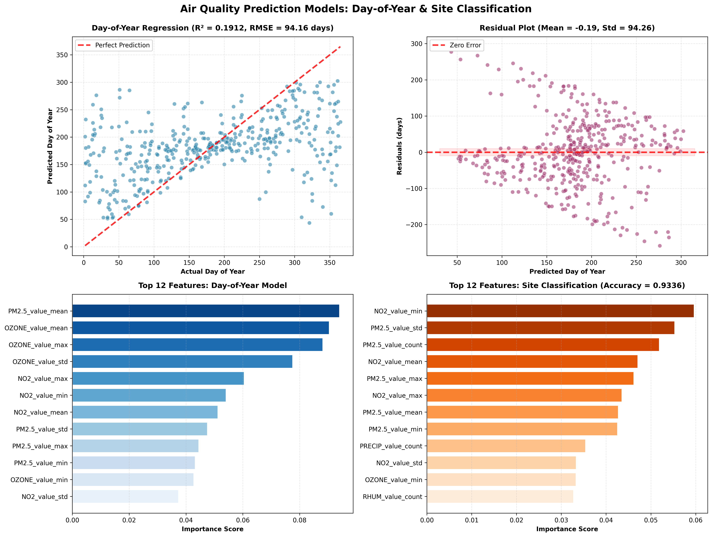

# New System Allows DC Government to Better Understand and Predict Air Quality

## Using live trackers and past data will help officials to understand where low air quality might appear, and take actions to mitigate it in the future.

Washington, DC is a large and bustling city and the activity of vehicles, homes, and businesses alongside natural events pose a challenge to maintaining a good and healthy air quality across the city, especially in poorer and minority neighbourhoods to the city's south and east. Currently, significant data is collected to furnish understanding of the levels of certain harmful chemicals in the air but looking forwards to understand patters and the effects of individual events is not possible. 

A new predictive model developed by a Charlottesville-based organisation will allow the DC government to utilise the existing data to make predictions on how certain days of the week, sporting events and others can affect the air quality and use that information to act for the safety of residents. This could include warning residents of upcoming air pollution exceeding a threshold on the night of the major independence day fireworks celebration, or looking at methods to mitigate effects of commute pollution.

